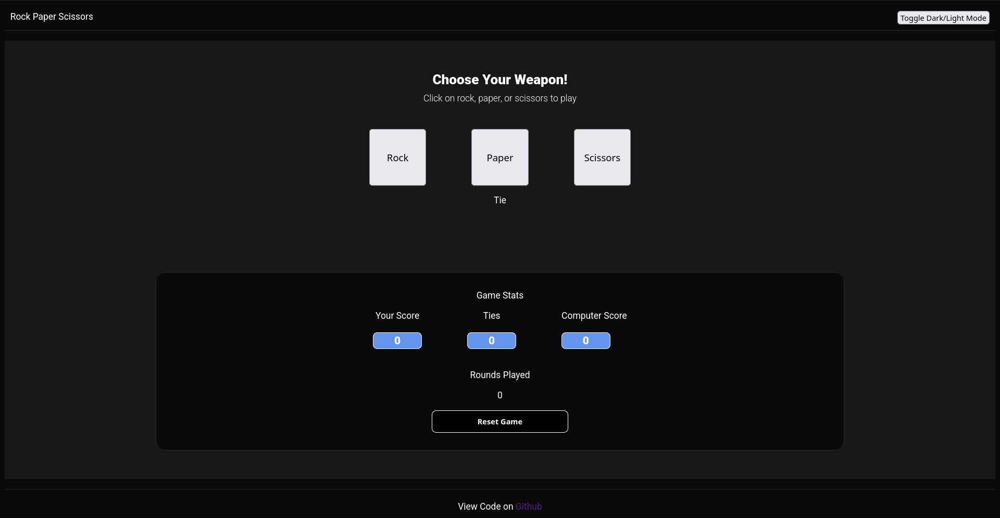

# Rock Paper Scissors

> A browser-based Rock Paper Scissors game built with vanilla HTML, CSS, and JavaScript.
> The project focuses on DOM manipulation, event handling, state management, and translating a simple ruleset into a complete interactive experience.

<p align="center">
  <a href="https://smailoujaoura.github.io/odin_rock_paper_scissors/"><strong>Live Demo</strong></a>
  &nbsp;|&nbsp;
  <a href="https://github.com/smailoujaoura/odin_rock_paper_scissors"><strong>Source Code</strong></a>
</p>



## Overview

This project recreates the classic Rock Paper Scissors game in the browser and turns it into a short, interactive 5-round match against the computer.

Instead of stopping at the game rules alone, the implementation adds a visible scoreboard, round tracking, tie handling, end-of-match feedback, and a reset flow. That makes it a strong fundamentals project because it combines logic, UI updates, and state transitions in one small codebase.

## Design Exploration

The `ref/` directory also contains early dark and light UI references used during planning. They are useful for showing design thinking and layout exploration before the final implementation was locked in.

<p align="center">
  
  
</p>

## Recruiter Takeaways

- Built end-to-end with plain HTML, CSS, and JavaScript without relying on frameworks.
- Demonstrates core front-end fundamentals: DOM selection, event listeners, state updates, conditional logic, and rendering.
- Shows incremental development through git history: layout first, then gameplay logic, then ties, then winner announcement.
- Deploys as a static site on GitHub Pages, which makes the project easy to review and share.

## Features

- Play Rock, Paper, or Scissors against a randomized computer choice
- Track player wins, computer wins, ties, and rounds played
- Automatically evaluate the winner of each round
- Announce the overall winner after 5 rounds
- Reset the game state and UI in one click
- Keep the interface lightweight and easy to understand

## Gameplay Flow

```mermaid
flowchart TD
	A[Player clicks Rock / Paper / Scissors] --> B[startRound(playerChoice)]
	B --> C[randomOption picks the computer move]
	C --> D[findWinner compares both choices]
	D --> E[Update wins ties and round counter]
	E --> F[Render result and scoreboard in the DOM]
	F --> G{Have 5 rounds been played?}
	G -- No --> H[Wait for next player action]
	G -- Yes --> I[announceWinner inserts final message]
	I --> J[Reset manually or begin a fresh match]
```

## Tech Stack

| Area | Used In Project |
| --- | --- |
| Structure | HTML5 |
| Styling | CSS3 |
| Logic | JavaScript |
| Deployment | GitHub Pages |
| Version Control | Git + GitHub |

## Project Structure

```text
.
|-- index.html
|-- style.css
|-- script.js
|-- docs/
|   `-- image.png
`-- ref/
	|-- dark mode.png
	`-- light mode.png
```

## Implementation Notes

The code is intentionally small, but it still follows a useful separation of concerns:

- `index.html` defines the layout, action buttons, score containers, and reset control.
- `style.css` handles the visual structure, layout spacing, and scoreboard styling.
- `script.js` owns the game state, round resolution, DOM updates, and reset logic.

Core responsibilities in the JavaScript layer:

- `findWinner(playerOption, computerOption)` contains the round-decision logic.
- `randomOption()` generates the computer move.
- `startRound(playerOption)` runs the main gameplay cycle.
- `announceWinner()` inserts an end-of-match summary into the page.
- `resetResults()` restores the UI and counters to their initial state.

## Code Highlight

One of the strongest parts of the project is that the game loop is easy to follow: get the player choice, generate the computer choice, compute the winner, update state, then render the result.

```js
function startRound(playerOption) {
	if (rounds === 5)
		resetResults();

	let winner = findWinner(playerOption, randomOption());
	rounds++;

	switch (winner) {
		case 'player':
			userWins++;
			break;
		case 'computer':
			compWins++;
			break;
		case 'tie':
			ties++;
	}

	totalRounds.textContent = rounds;
	result.textContent = winner.toUpperCase();
	tiesScore.textContent = ties;
	playerScore.textContent = userWins;
	computerScore.textContent = compWins;

	if (rounds === 5)
		announceWinner();
}
```

That kind of direct flow is valuable in beginner-to-intermediate projects because it keeps the logic debuggable and makes each state transition visible.

## What I Learned

- How to connect JavaScript logic to a real user interface instead of keeping the game in the console
- How to cache DOM elements after `DOMContentLoaded` and update them as the game progresses
- How to model application state with a few focused variables such as wins, ties, and rounds
- How to break a small project into functions with single responsibilities
- How to ship a project from idea to deployment using GitHub Pages
- How to iterate in small, meaningful steps through git commits

## Challenges

- Translating simple game rules into browser interactions that feel responsive and clear
- Making sure the scoreboard always stayed in sync with the underlying state
- Handling ties as a separate outcome instead of treating them like an afterthought
- Ending the match cleanly after 5 rounds and showing the correct final announcement
- Resetting both the UI and the internal counters without leaving stale values behind

## Optimization and Engineering Choices

This project is deliberately simple, but there are still a few good engineering decisions inside it:

- DOM elements are selected once after `DOMContentLoaded` instead of being queried repeatedly during each round.
- The winner logic runs in constant time using direct conditional checks.
- Game state is kept in a small set of counters, which makes debugging easier.
- The round logic and the UI update logic are grouped into clear functions, which improves readability.
- The app has no build step, no dependencies, and minimal overhead, so it loads quickly and is easy to deploy.

## Academic Value

This project is small enough to understand quickly, but rich enough to practice important software concepts:

- Event-driven programming
- State management
- Branching and decision trees
- Pseudorandom behavior
- DOM manipulation
- UI feedback loops
- Incremental development and version control
- Refactoring opportunities in a real codebase

For a fundamentals curriculum, that makes the project academically useful because it bridges syntax knowledge and actual application behavior.

## Development Progression

The git history tells a clear learning story:

1. Start with interface references and visual planning
2. Build the HTML and CSS structure
3. Add core JavaScript gameplay
4. Track ties as part of the score model
5. Add a 5-round win condition
6. Show a final winner announcement in the interface

That progression reflects a practical way to build software: start with structure, add behavior, then refine the user experience.

## Running the Project Locally

Because this is a static project, there is no install step.

1. Clone the repository
2. Open `index.html` in a browser

If you prefer using a local server, any lightweight static server will work as well.

## Future Improvements

- Refactor the game state into an object or module pattern
- Replace inline winner styles with reusable CSS classes
- Add keyboard accessibility and clearer focus states
- Display both the player choice and computer choice after each round
- Persist match history or high scores with `localStorage`
- Add tests for the winner-resolution logic

## Conclusion

This project demonstrates more than just a simple game. It shows the ability to turn a small idea into a complete, deployed browser application with real interaction, visible state changes, and clear user feedback.

For recruiters and reviewers, the strongest signal is not complexity for its own sake. It is the fact that the project is finished, understandable, and built on solid front-end fundamentals.
